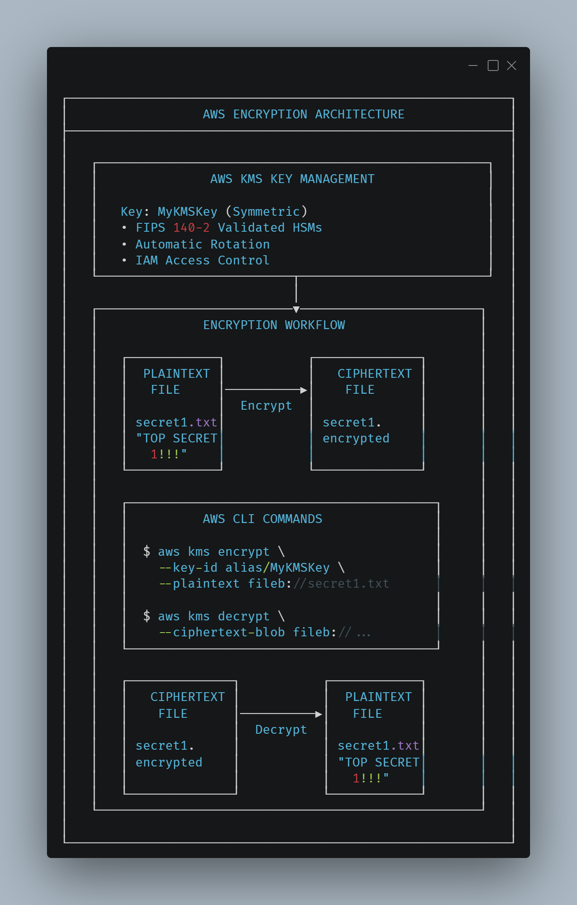
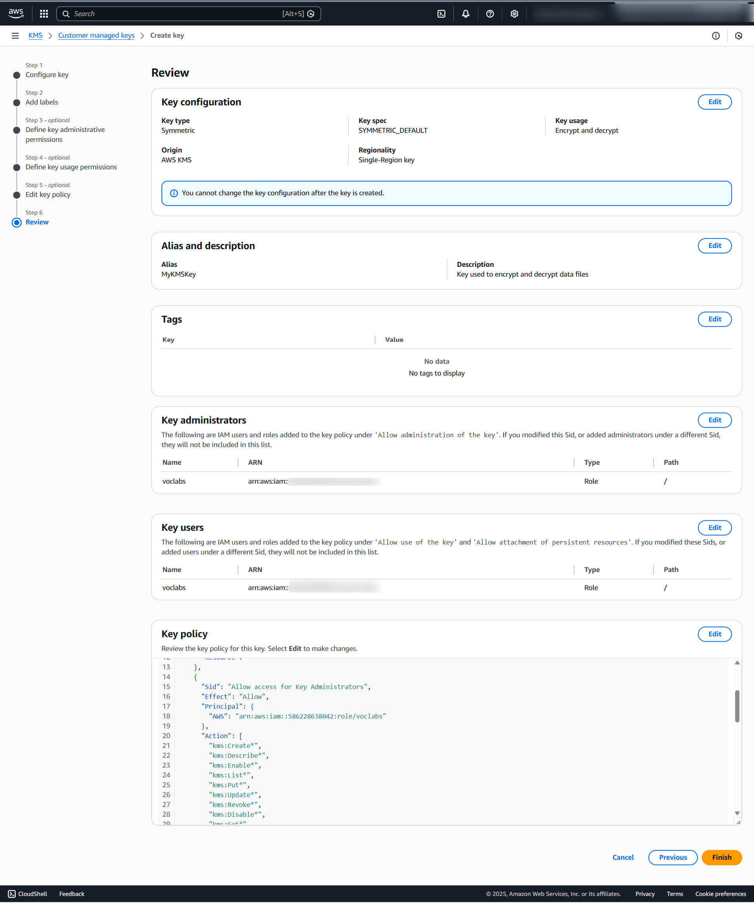
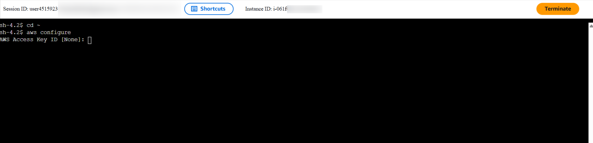
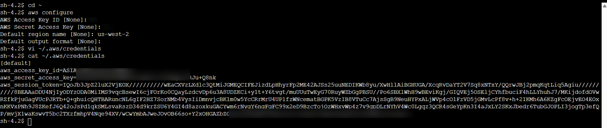
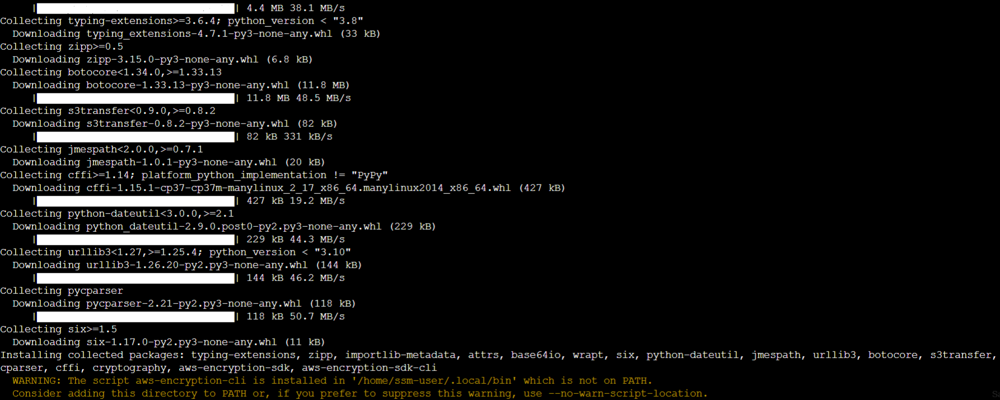
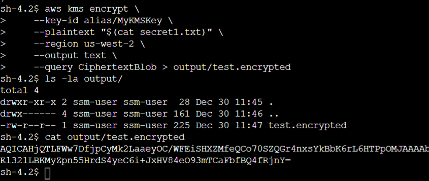
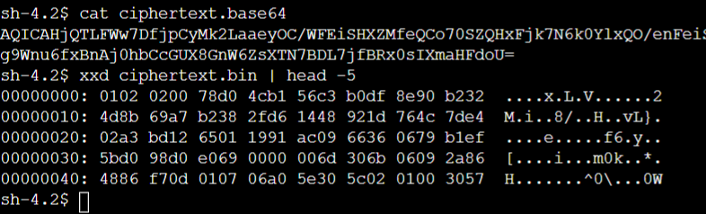
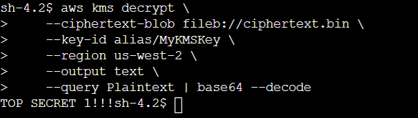

# 🔒 AWS Data Protection Lab: Encryption with KMS & Encryption CLI 

## Overview
Implementation of data encryption-at-rest using AWS Key Management Service (KMS) and AWS Encryption CLI to protect sensitive files. This lab demonstrates end-to-end cryptographic operations including key creation, file encryption, and secure decryption.

## 🎯 Objectives
- Create and manage symmetric encryption keys using AWS KMS
- Configure AWS Encryption CLI on EC2 instances
- Encrypt plaintext files into ciphertext
- Decrypt ciphertext back to readable plaintext
- Implement encryption context for additional security

## 🏗️ Architecture

*Data protection pipeline using AWS KMS for key management and Encryption CLI for file operations*

## 🔧 Technologies & Services
- **AWS Key Management Service (KMS)** - Cryptographic key management
- **AWS Encryption CLI** - Command-line encryption tool
- **AWS EC2** - File Server instance
- **AWS Systems Manager Session Manager** - Secure instance access
- **AWS IAM Roles** - Permission management

## 📊 Key Security Features
- **Symmetric Encryption:** AES-GCM algorithm with 256-bit keys
- **Key Management:** FIPS 140-2 validated HSMs
- **Encryption Context:** Additional authentication data
- **Commitment Policy:** `require-encrypt-require-decrypt` for enhanced security

## 🚀 Implementation Journey

### Phase 1: KMS Key Creation

*Creating symmetric KMS key "MyKMSKey" with proper IAM permissions*

### Phase 2: File Server Setup

*Secure connection to EC2 instance using AWS Systems Manager Session Manager*

### Phase 3: AWS Configuration

*Configuring AWS credentials with temporary session tokens for secure access*

### Phase 4: Encryption CLI Installation

*Installing AWS Encryption SDK CLI using pip package manager*

### Phase 5: File Encryption Process

*Plaintext file containing sensitive data before encryption*

### Phase 6: Encryption Execution  

*Executing encryption command with KMS key ARN and encryption context*

### Phase 7: Encrypted Output

*Encrypted file showing unreadable ciphertext representation*

### Phase 8: Decryption & Verification

*Successful decryption returning original plaintext content*

## 🔐 Security Best Practices Implemented
- ✅ **Key Rotation:** AWS KMS supports automatic key rotation
- ✅ **Access Control:** IAM policies restrict key usage to authorized entities
- ✅ **Audit Trail:** AWS CloudTrail logs all KMS API calls
- ✅ **Encryption Context:** Provides additional authenticated data
- ✅ **Secure Access:** Session Manager eliminates SSH key management

## 🛠️ Technical Implementation

### KMS Key Creation

```bash
# Create symmetric encryption key
aws kms create-key \
    --description "Key used to encrypt and decrypt data files" \
    --key-usage ENCRYPT_DECRYPT \
    --origin AWS_KMS
```

## 👨‍💻 Author
**Renaldi** | Cloud Security Specialist  
[GitHub Profile](https://github.com/SilentVeil) | [LinkedIn](https://linkedin.com/in/renaldi-tan)

*Note: This project demonstrates data protection techniques as part of AWS security hardening series.*
